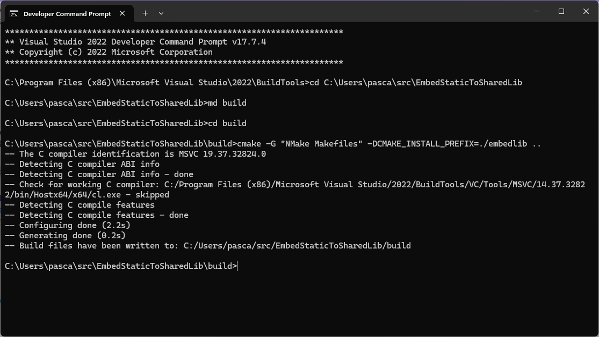
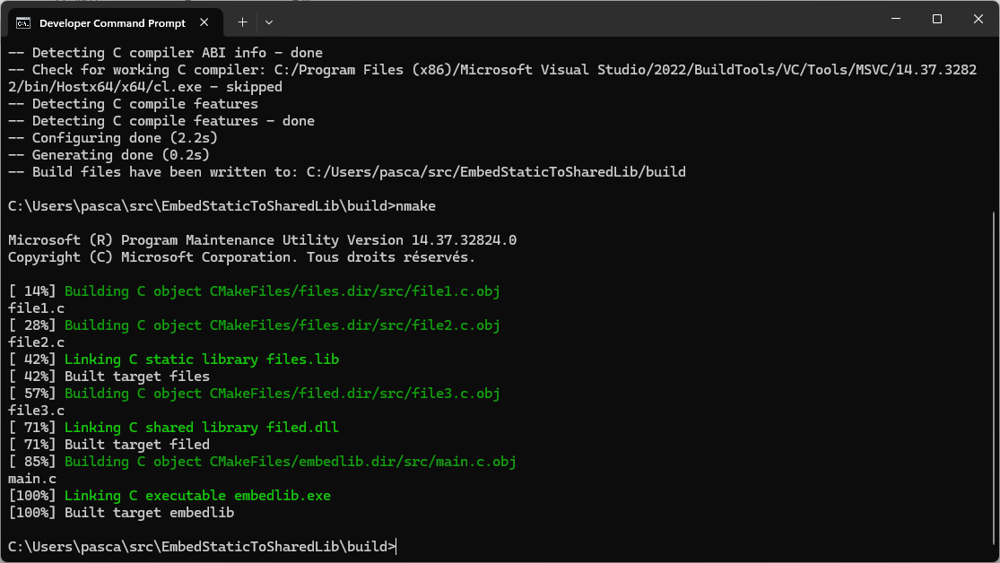
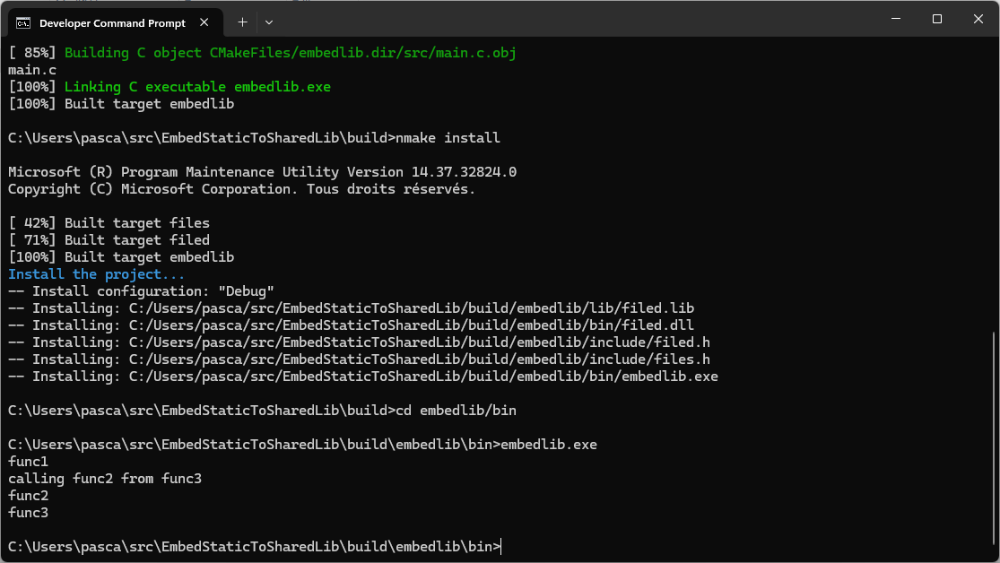

# Embed a static library to a shared library

Very often, you get a static library from some other source, which you need to use for your purposes. What if you finally are working towards creation of a dynamic library, which uses symbols (or functions) from the static library? How do you “link” the symbols in the static library to your dynamic library so that there will be no “undefined” symbols at runtime? This article helps to bust this problem.

The idea is to embed all the functions of the static library in the shared library.

This reduces dependencies and allows you to include a static library without recompiling it while respecting the license.

Inspired by the article [How can I link a static library to a dynamic library?](https://blog.ramdoot.in/how-can-i-link-a-static-library-to-a-dynamic-library-e1f25c8095ef)

In this tutorial, the static library `libfiles` is compiled from the files file1.c and file2.c, while the dynamic library `libfiled` is compiled from the file file3.c and embeds all the symbols and functions of `libfiles`. The source files are in src/, the header files in include/. 


## Static library files

**include/files.h**

```c
#pragma once
void func1();
void func2();
```

**src/file1.c**

```c
#include <stdio.h>

void func1() {
  printf ("func1\n");
}
```

**src/file2.c**

```c
#include <stdio.h>

void func2() {
  printf ("func2\n");
}
```

## Dynamic library files

La bibliothèque dynamique inclura la bibliothèque statique et utilisera ses fonctions.

**include/filed.h**

```c
#pragma once
#include "files.h"
void func3();
```

**src/file3.c**

```c
#include <stdio.h>
#include "files.h"

void func3() {
  printf ("calling func2 from func3\n");
  func2();
  printf ("func3\n");
}
```

## Main program

**src/main.c**

```c
#include "filed.h"

int main() {
  func1();
  func3();
  return 0;
}
```

## With gcc on Linux or other Unix-like systems

First, create the directories that will contain the generated files:

```bash
mkdir -p obj lib bin
``` 

Build the relocatable object files:

```bash
gcc -c -fPIC src/file1.c -o obj/file1.o -Iinclude
gcc -c -fPIC src/file2.c -o obj/file2.o -Iinclude
gcc -c -fPIC src/file3.c -o obj/file3.o -Iinclude
```

Then create the static library:

```bash
ar rcs lib/libfiles.a obj/file1.o obj/file2.o
ranlib lib/libfiles.a
```

Then create the dynamic library:

```bash
gcc -o lib/libfiled.so -Wl,--whole-archive lib/libfiles.a -Wl,--no-whole-archive -shared obj/file3.o
```

Build the embedlib program:

```bash
gcc -o bin/embedlib src/main.c -Llib -lfiled -Wl,-rpath,./lib -Iinclude
```

## Execution

```bash
$ bin/embedlib
func1
calling func2 from func3
func2
func3
```

There you have it, the dynamic library has called a function from the static library.

## with Gnu Make on Linux or other Unix-like systems

Now, let's automate the process with a Makefile:

```makefile
SRC_DIR := src
OBJ_DIR := obj
BIN_DIR := bin
LIB_DIR := lib

EXE := $(BIN_DIR)/embedlib
EXE_SRC := $(SRC_DIR)/main.c
EXE_OBJ := $(EXE_SRC:$(SRC_DIR)/%.c=$(OBJ_DIR)/%.o)

LIBSTATIC := $(LIB_DIR)/libfiles.a
LIBSTATIC_SRC := $(SRC_DIR)/file1.c $(SRC_DIR)/file2.c
LIBSTATIC_OBJ := $(LIBSTATIC_SRC:$(SRC_DIR)/%.c=$(OBJ_DIR)/%.o)

LIBSHARED := $(LIB_DIR)/libfiled.so
LIBSHARED_SRC := $(SRC_DIR)/file3.c
LIBSHARED_OBJ := $(LIBSHARED_SRC:$(SRC_DIR)/%.c=$(OBJ_DIR)/%.o)

LIB_SRC := $(LIBSTATIC_SRC) $(LIBSHARED_SRC)
LIB_OBJ := $(LIBSTATIC_OBJ) $(LIBSHARED_OBJ)

CPPFLAGS := -Iinclude -MMD -MP
CFLAGS   := -Wall
LDFLAGS  := -Llib
LDLIBS   := -lfiled

.PHONY: all clean

all: $(EXE)

$(OBJ_DIR)/%.o: $(SRC_DIR)/%.c | $(OBJ_DIR)
	$(CC) $(CPPFLAGS) $(CFLAGS) -fPIC -c $< -o $@

$(LIBSTATIC): $(LIBSTATIC_OBJ) | $(LIB_DIR)
	ar rcs $@ $^
	ranlib $@

$(LIBSHARED): $(LIBSHARED_OBJ) $(LIBSTATIC) | $(LIB_DIR)
	$(CC) -shared -o $@ -Wl,--whole-archive $(LIBSTATIC) -Wl,--no-whole-archive  $<
	
$(EXE_OBJ): $(EXE_SRC) | $(OBJ_DIR)
	$(CC) $(CPPFLAGS) $(CFLAGS) -c $< -o $@

$(EXE): $(EXE_OBJ) $(LIBSHARED) | $(BIN_DIR)
	$(CC) $(LDFLAGS) $< $(LDLIBS) -Wl,-rpath,./lib -o $@

$(BIN_DIR) $(OBJ_DIR) $(LIB_DIR):
	mkdir -p $@

clean:
	@$(RM) -rv $(BIN_DIR) $(OBJ_DIR) $(LIB_DIR)

-include $(OBJ:.o=.d)
```

```bash
$ make
mkdir -p obj
cc -Iinclude -MMD -MP -Wall -c src/main.c -o obj/main.o
cc -Iinclude -MMD -MP -Wall -fPIC -c src/file3.c -o obj/file3.o
cc -Iinclude -MMD -MP -Wall -fPIC -c src/file1.c -o obj/file1.o
cc -Iinclude -MMD -MP -Wall -fPIC -c src/file2.c -o obj/file2.o
mkdir -p lib
ar rcs lib/libfiles.a obj/file1.o obj/file2.o
ranlib lib/libfiles.a
cc -shared -o lib/libfiled.so -Wl,--whole-archive lib/libfiles.a -Wl,--no-whole-archive  obj/file3.o
mkdir -p bin
cc -Llib obj/main.o -lfiled -Wl,-rpath,./lib -o bin/embedlib
```

## with CMake

The previous solutions are for Linux or Unix-like systems. For portability, we can use CMake.

The CMakeLists.txt file:

```cmake
cmake_minimum_required(VERSION 3.13)
project(embedlib LANGUAGES C)

if (MSVC)
    set(CMAKE_WINDOWS_EXPORT_ALL_SYMBOLS ON)
endif()

# Create a static library with the files library
add_library(files STATIC)
target_include_directories(files PRIVATE "${PROJECT_SOURCE_DIR}/include")
target_sources(files 
    PRIVATE 
        src/file1.c 
        src/file2.c 
    PUBLIC 
        include/files.h)

# Now create a shared library that embeds the files library
add_library(filed SHARED)
target_include_directories(filed PUBLIC "${PROJECT_SOURCE_DIR}/include")
target_sources(filed 
    PRIVATE 
        src/file3.c 
    PUBLIC
        include/filed.h)
set_target_properties(filed PROPERTIES PUBLIC_HEADER "include/filed.h;include/files.h")

# This is a simple example of how to embed a library in another library
# Since CMake 3.24, the CMAKE_LINK_LIBRARY_USING_WHOLE_ARCHIVE feature is available
# see https://cmake.org/cmake/help/latest/variable/CMAKE_LANG_LINK_LIBRARY_USING_FEATURE.html
if(CMAKE_C_COMPILER_ID STREQUAL "AppleClang")
    target_link_options(filed PUBLIC "-force_load" "$<TARGET_FILE:files>")
elseif(CMAKE_C_COMPILER_ID STREQUAL "GNU" AND CMAKE_SYSTEM_NAME STREQUAL "Linux")
    target_link_options(filed PUBLIC "-Wl,--whole-archive" "$<TARGET_FILE:files>" "-Wl,--no-whole-archive")
elseif(CMAKE_C_COMPILER_ID STREQUAL "MSVC")
    target_link_options(filed PUBLIC "/WHOLEARCHIVE:$<TARGET_FILE:files>")
else()
    # feature not yet supported for the other environments
    message(FATAL_ERROR "CMAKE_LINK_LIBRARY_USING_WHOLE_ARCHIVE not supported")
endif()

# Create an executable that uses the filed library    
add_executable(${PROJECT_NAME})
target_sources(${PROJECT_NAME} PRIVATE "src/main.c")
target_link_libraries(${PROJECT_NAME} PRIVATE filed)

install(TARGETS filed PUBLIC_HEADER)
install(TARGETS ${PROJECT_NAME})
# Add the install directory to the rpath of the executable
set_target_properties(${PROJECT_NAME} PROPERTIES
    INSTALL_RPATH "${CMAKE_INSTALL_PREFIX}/lib")

# Add an uninstall target
configure_file(
    "${CMAKE_CURRENT_SOURCE_DIR}/cmake_uninstall.cmake.in"
    "${CMAKE_CURRENT_BINARY_DIR}/cmake_uninstall.cmake"
    IMMEDIATE @ONLY)
add_custom_target(uninstall
    COMMAND ${CMAKE_COMMAND} -P ${CMAKE_CURRENT_BINARY_DIR}/cmake_uninstall.cmake)
```

Then you can build and install the project. Below is an example of how to build and run the program on Linux:

```bash
$ mkdir -p build
$ cd build
$ cmake ..
-- The C compiler identification is GNU 11.4.0
-- Detecting C compiler ABI info
-- Detecting C compiler ABI info - done
-- Check for working C compiler: /usr/bin/cc - skipped
-- Detecting C compile features
-- Detecting C compile features - done
-- Configuring done
-- Generating done
-- Build files have been written to: /home/epsilonrt/src/EmbedStaticToSharedLib/build
$ make
[ 14%] Building C object CMakeFiles/files.dir/src/file1.c.o
[ 28%] Building C object CMakeFiles/files.dir/src/file2.c.o
[ 42%] Linking C static library libfiles.a
[ 42%] Built target files
[ 57%] Building C object CMakeFiles/filed.dir/src/file3.c.o
[ 71%] Linking C shared library libfiled.so
[ 71%] Built target filed
[ 85%] Building C object CMakeFiles/embedlib.dir/src/main.c.o
[100%] Linking C executable embedlib
[100%] Built target embedlib
$ sudo make install
Consolidate compiler generated dependencies of target files
[ 42%] Built target files
Consolidate compiler generated dependencies of target filed
[ 71%] Built target filed
Consolidate compiler generated dependencies of target embedlib
[100%] Built target embedlib
Install the project...
-- Install configuration: ""
-- Installing: /usr/local/lib/libfiled.so
-- Installing: /usr/local/include/filed.h
-- Installing: /usr/local/include/files.h
-- Installing: /usr/local/bin/embedlib
-- Set runtime path of "/usr/local/bin/embedlib" to "/usr/local/lib"
$ embedlib 
func1
calling func2 from func3
func2
func3
```

Then the same program can be run on Windows, using the Visual Studio Developer Command Prompt and the NMake generator. Below is an example of how to build and run the program on Windows with Visual Studio 2022 Build Tools, first create the build directory and configure the project with CMake:

```cmd
**********************************************************************
** Visual Studio 2022 Developer Command Prompt v17.7.4
** Copyright (c) 2022 Microsoft Corporation
**********************************************************************

C:\Program Files (x86)\Microsoft Visual Studio\2022\BuildTools>cd C:\Users\pasca\src\EmbedStaticToSharedLib

C:\Users\pasca\src\EmbedStaticToSharedLib>md build

C:\Users\pasca\src\EmbedStaticToSharedLib>cd build

C:\Users\pasca\src\EmbedStaticToSharedLib\build>cmake -G "NMake Makefiles" -DCMAKE_INSTALL_PREFIX=./embedlib ..
-- The C compiler identification is MSVC 19.37.32824.0
-- Detecting C compiler ABI info
-- Detecting C compiler ABI info - done
-- Check for working C compiler: C:/Program Files (x86)/Microsoft Visual Studio/2022/BuildTools/VC/Tools/MSVC/14.37.32822/bin/Hostx64/x64/cl.exe - skipped
-- Detecting C compile features
-- Detecting C compile features - done
-- Configuring done (2.2s)
-- Generating done (0.2s)
-- Build files have been written to: C:/Users/pasca/src/EmbedStaticToSharedLib/build
```



  Then build with NMake:
  
  ```cmd
C:\Users\pasca\src\EmbedStaticToSharedLib\build>nmake

Microsoft (R) Program Maintenance Utility Version 14.37.32824.0
Copyright (C) Microsoft Corporation. Tous droits réservés.

[ 14%] Building C object CMakeFiles/files.dir/src/file1.c.obj
file1.c
[ 28%] Building C object CMakeFiles/files.dir/src/file2.c.obj
file2.c
[ 42%] Linking C static library files.lib
[ 42%] Built target files
[ 57%] Building C object CMakeFiles/filed.dir/src/file3.c.obj
file3.c
[ 71%] Linking C shared library filed.dll
[ 71%] Built target filed
[ 85%] Building C object CMakeFiles/embedlib.dir/src/main.c.obj
main.c
[100%] Linking C executable embedlib.exe
[100%] Built target embedlib
```



Then install the program:

```cmd
C:\Users\pasca\src\EmbedStaticToSharedLib\build>nmake install

Microsoft (R) Program Maintenance Utility Version 14.37.32824.0
Copyright (C) Microsoft Corporation. Tous droits réservés.

[ 42%] Built target files
[ 71%] Built target filed
[100%] Built target embedlib
Install the project...
-- Install configuration: "Debug"
-- Installing: C:/Users/pasca/src/EmbedStaticToSharedLib/build/embedlib/lib/filed.lib
-- Installing: C:/Users/pasca/src/EmbedStaticToSharedLib/build/embedlib/bin/filed.dll
-- Installing: C:/Users/pasca/src/EmbedStaticToSharedLib/build/embedlib/include/filed.h
-- Installing: C:/Users/pasca/src/EmbedStaticToSharedLib/build/embedlib/include/files.h
-- Installing: C:/Users/pasca/src/EmbedStaticToSharedLib/build/embedlib/bin/embedlib.exe

C:\Users\pasca\src\EmbedStaticToSharedLib\build>
```

Finally, run the program:

```cmd
C:\Users\pasca\src\EmbedStaticToSharedLib\build>cd embedlib/bin

C:\Users\pasca\src\EmbedStaticToSharedLib\build\embedlib\bin>embedlib.exe
func1
calling func2 from func3
func2
func3
```

